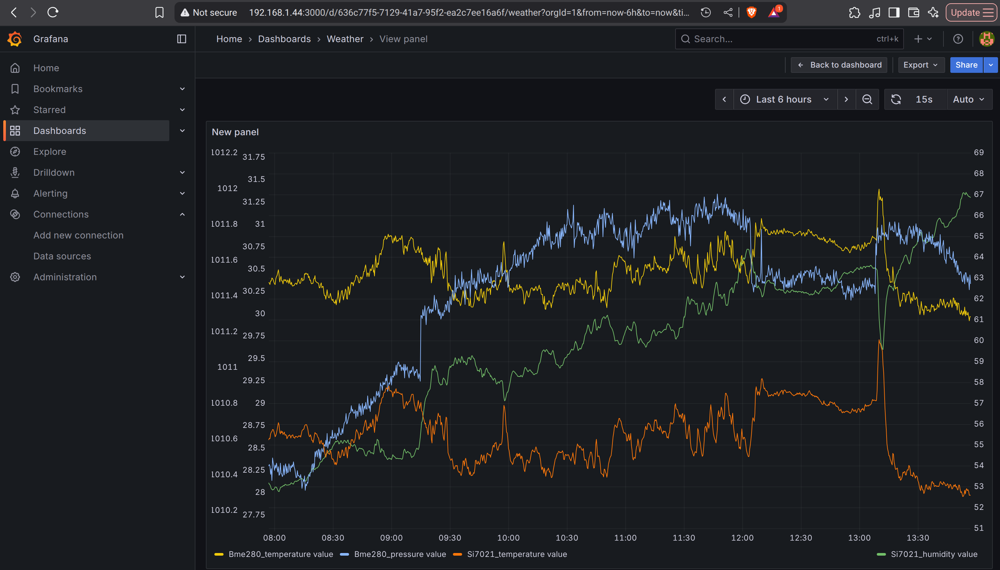
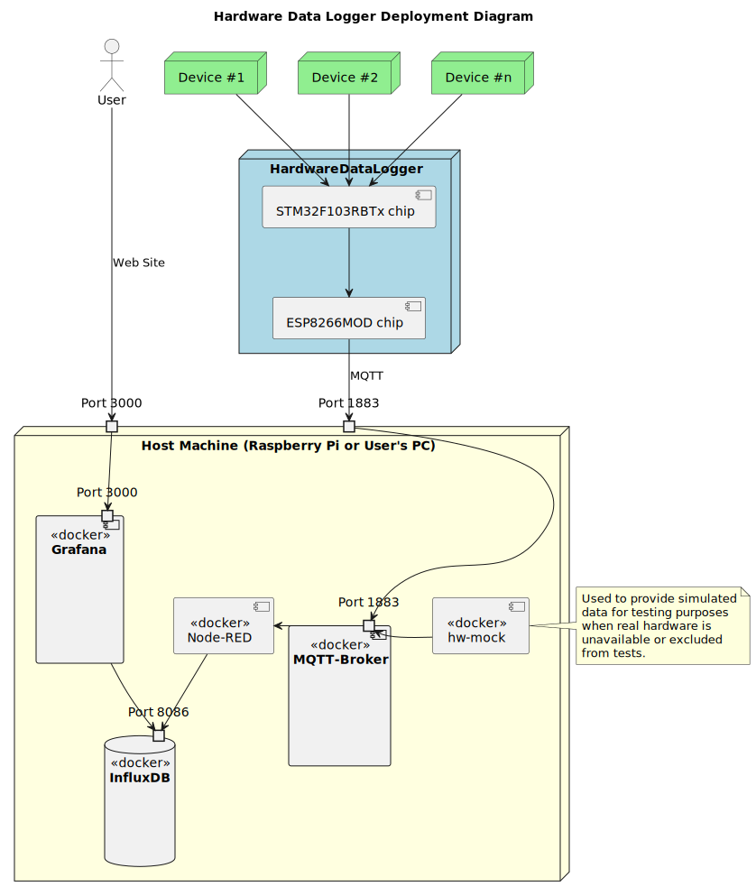

# IoT Data Logging and Visualization Stack

## Purpose

Set of software that turns raw sensor readings from your IoT devices into measurement graphs that can be visualized via web browser.

The repository is intended to provide data processing and data visualization for [HardwareDataLogger](https://github.com/RobertGawron/HardwareDataLogger) and [PiWeatherShield](https://github.com/RobertGawron/PiWeatherShield), but can be easily reused for other projects too.

The goal is to:
  * Have a web user interface in Grafana and Home Assistant.
  * Store measurement data in InfluxDB.
  * Get measurements via MQTT.

## Architecture

Docker Compose is used to manage all software components. These components include:
  * Grafana - platform for visualizing and analyzing measurements.
  * InfluxDB - database optimized for storing time-series.
  * Node-RED - glue between MQTT protocol and database.
  * Eclipse Mosquitto - MQTT server.
  * [hw-mock - docker image with a Python script that can generate fake measurement data to test the system without the need for an actual device.](./Target/Test/README.md) It was used only at the beginning for first tests, normally not deployed/used

All these components come as ready-to-use Docker images. No code is modified; only the configuration needs to be done. The configuration is kept between restarts of the machine thanks to Docker Compose volumes.

# Setup, Usage, Deployment

The idea is to have a local Docker image to build all blocks and install them on a remote host (Raspberry Pi). Files for the Docker image for building the application are in the **Host** directory; files related to the actual Docker images with the applications that will be deployed on the target are in the **Target** directory.

The manual on how to [set up Docker for making builds is available here.](./Host/README.md)

Here is a manual on how to [set up a fresh Raspberry Pi](./Documentation/Manuals/SettingUpRaspberryPi.md); it contains info on how to get the IP of the Raspberry connected to the local host, etc.

[Deploying the Docker images is shown in this manual.](./Target/README.md)
