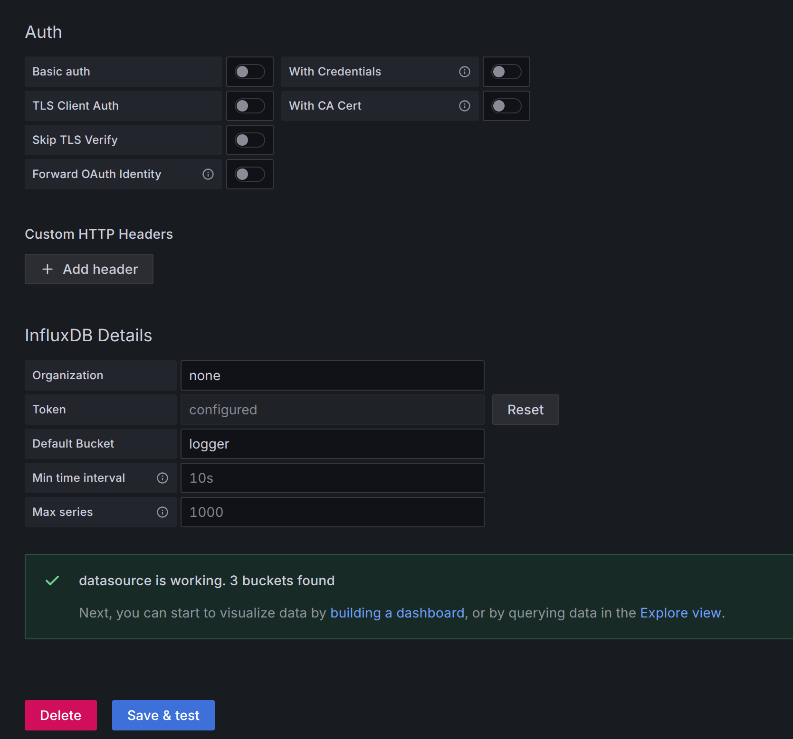
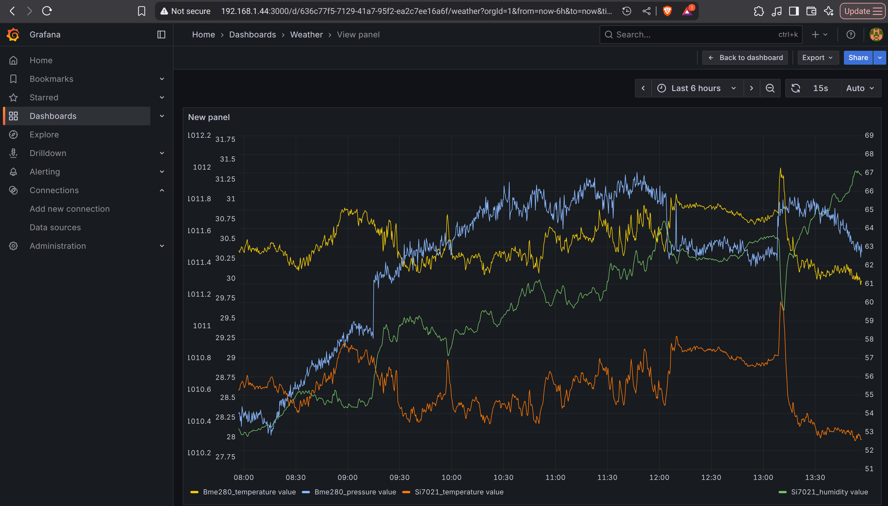

# Purpose

Build target images of this project and deploy them to a Raspberry Pi.

# Assumptions

The build environment is configured according to the manual.

# Setting up remote host as a deployment target

Create a context (adjust the username and hostname to your Raspberry Pi):

```
docker context create pi --docker "host=ssh://robert@192.168.1.44"
```

Switch to the Pi context:

```
docker context use pi
```

# Build and deploy

In the directory where this file is located, build the Docker images:

```
docker-compose build
```

Start the Docker images:

```
docker compose up -d --remove-orphans
```


# Configuration of the deployed modules

### MQTT Server

The MQTT server needs to have enabled external connections; this is already done in the Docker Compose file.


### InfluxDb

Open a web browser and go to the IP of your Raspberry Pi, selecting port 1880. For example, this would be (note that this is not https) http://192.168.1.44:8086/ if your Raspberry Pi has the IP address 192.168.1.44.

During set up, you will be asked for the organization and bucket name; put whatever but note these, as they will be used later to configure Node-RED.

You will be asked to create an admin account, and a token for this user will be generated. Save the token.

Go to the API Token tab and click "Generate new token." Save the token.


### Node-RED

Node-RED needs to have installed npm packages for communication via MQTT protocol; this is also done in Docker Compose.

Open a web browser and go to the IP of your Raspberry Pi, selecting port 1880. For example, this would be (note that this is not https) http://192.168.1.44:1880/ if your Raspberry Pi has the IP address 192.168.1.44.

Model the following diagram:


Open the function node and place following code:

```
// incoming msg.topic: "weather/Bme280/temperature"
// incoming msg.payload: { timestamp_ms: 123, value: 22.5 }

// Step 1: Securely save the timestamp before we change the payload
const timestamp_ms = msg.payload.timestamp_ms;

// Step 2: Split the topic to get our parts
const topic_parts = msg.topic.split('/');
const station_id = topic_parts[1]; // -> "Bme280"
const metric = topic_parts[2];     // -> "temperature"

// The payload object contains the field(s).
msg.payload = {
    value: msg.payload.value
};

// Combine the station and metric to create a specific measurement name.
msg.measurement = `${station_id}_${metric}`; // -> "Bme280_temperature"

// We can still keep the station as a tag. This is very useful for
// querying all data from a single sensor, e.g., "show me everything from Bme280".
msg.tags = {
    station: station_id
};

// Set the timestamp.
msg.timestamp = new Date(timestamp_ms);

// Return the completely restructured message object.
return msg;
```

Configure MQTT


Configure the database. In the "Token" field, place the token you generated in the previous step.


Go to the InfluxDB web page we used previously and find your time series. If they are there, great—it works. Click "SUBMIT," and you will already see measurement plots. That would be enough, but in the next step, we will configure Grafana to create even nicer plots.


### Grafana

Open a web browser and go to the IP of your Raspberry Pi, selecting port 1880. For example, this would be (note that this is not https) http://192.168.1.44:3000/ if your Raspberry Pi has the IP address 192.168.1.44.

Go to "Data Sources" and set:
    * "Query Language": "Flux"
    * "URL": "http://influxdb:8086"
    * Token and organization as generated during the setup of InfluxDB

Click "Save and test"; a green message saying that the connection is OK should appear.





Go to "dashboard", in the Query Window put:


```
from(bucket: "logger")
  |> range(start: v.timeRangeStart, stop: v.timeRangeStop)
  |> filter(fn: (r) => r._measurement == "Si7021_temperature")
  |> filter(fn: (r) => r._field == "value")
  |> aggregateWindow(every: v.windowPeriod, fn: mean, createEmpty: false)
  |> yield(name: "Si7021 temperature")

from(bucket: "logger")
  |> range(start: v.timeRangeStart, stop: v.timeRangeStop)
  |> filter(fn: (r) => r._measurement == "Si7021_humidity")
  |> filter(fn: (r) => r._field == "value")
  |> aggregateWindow(every: v.windowPeriod, fn: mean, createEmpty: false)
  |> yield(name: "Si7021 humidity")

  from(bucket: "logger")
  |> range(start: v.timeRangeStart, stop: v.timeRangeStop)
  |> filter(fn: (r) => r._measurement == "Bme280_temperature")
  |> filter(fn: (r) => r._field == "value")
  |> aggregateWindow(every: v.windowPeriod, fn: mean, createEmpty: false)
  |> yield(name: "Bme280 temperature")

  from(bucket: "logger")
  |> range(start: v.timeRangeStart, stop: v.timeRangeStop)
  |> filter(fn: (r) => r._measurement == "Bme280_pressure")
  |> filter(fn: (r) => r._field == "value")
  |> aggregateWindow(every: v.windowPeriod, fn: mean, createEmpty: false)
  |> yield(name: "Bme280 pressure")
```


Scroll down until you find the "Series overrides" section. Click on it.
Click the blue "Add override" button.
In the first dropdown ("Fields with name"), select your pressure series. It should appear in the list as Bme280 pressure (the name comes from your yield statement).
Now that you've targeted the pressure series, click the "+ Add override property" button below it.
A menu will appear. Find and select Axis > Placement.
A new dropdown will show up. Change its value from Auto to Right.

Repeat for pressure series.

Save the Dasboard (upper right button).

Final result


